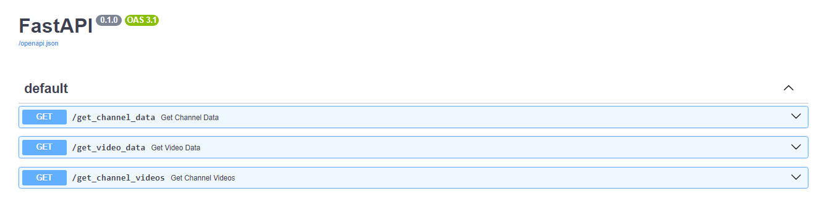

# YouTube Data API Project

This project, developed with **FastAPI**, enables the extraction of YouTube data such as channel and video information using the **YouTube Data API v3**. With optimized endpoints, you can retrieve details about a specific channel or video, or get information on all videos from a given channel.




## Requirements

- **Python 3.8+**
- **FastAPI** for API development
- **Google API Client** to connect to the YouTube API

## Installation

1. Clone the repository.
   ```bash
   git clone <repository_url>
   ```
2. Install the project dependencies.
   ```bash
   pip install -r requirements.txt
   ```
3. Set up the YouTube API key in the main file (replace `API_KEY` with your valid API key).

## Usage

To start the server, run the following command:
```bash
uvicorn main:app --reload
```

Remember to access the API documentation by adding /docs to the generated URL, like this: http://127.0.0.1:8000/docs. This will open FastAPI's interactive documentation, making it easy to test and explore endpoints directly.

## Endpoints

### 1. `GET /get_channel_data`
**Description:** Returns information about a YouTube channel from its URL.

- **Query Parameter:** `url` (str) - Channel URL.
- **JSON Response:**
  ```json
  {
    "channel title": "Channel name",
    "custom url": "https://www.youtube.com/...",
    "id url": "https://www.youtube.com/channel/...",
    "description": "Channel description",
    "subscriber count": "Number of subscribers",
    "video count": "Number of videos",
    "view count": "Total view count"
  }
  ```

### 2. `GET /get_video_data`
**Description:** Provides detailed information about a YouTube video using its URL.

- **Query Parameter:** `url` (str) - Video URL.
- **JSON Response:**
  ```json
  {
    "url": "https://www.youtube.com/watch?v=...",
    "title": "Video title",
    "published at": "Publication date",
    "description": "Description",
    "view count": "Number of views",
    "comment count": "Number of comments",
    "like count": "Number of likes",
    "category": "Video category",
    "Consultation date": "Consultation date"
  }
  ```

### 3. `GET /get_channel_videos`
**Description:** Retrieves information for all videos on a YouTube channel.

- **Query Parameter:** `url` (str) - Channel URL.
- **JSON Response:** List of objects containing information on each video in the channel.
  ```json
  [
    {
      "url": "https://www.youtube.com/watch?v=...",
      "title": "Video title",
      "published at": "Publication date",
      ...
    },
    ...
  ]
  ```

## Implementation Notes

- **Result Pagination:** To retrieve all videos from a channel, the `get_channel_videos` function uses pagination via the `next_page_token`.
- **Request Delay:** To prevent overloading the YouTube API, brief delays are introduced between requests (`time.sleep()`).